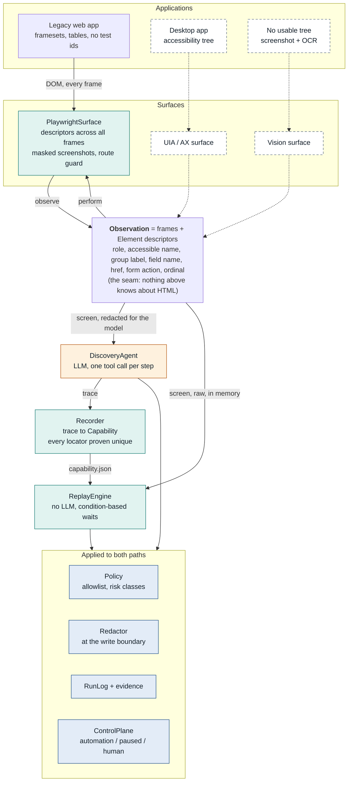
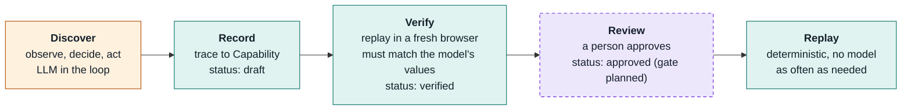
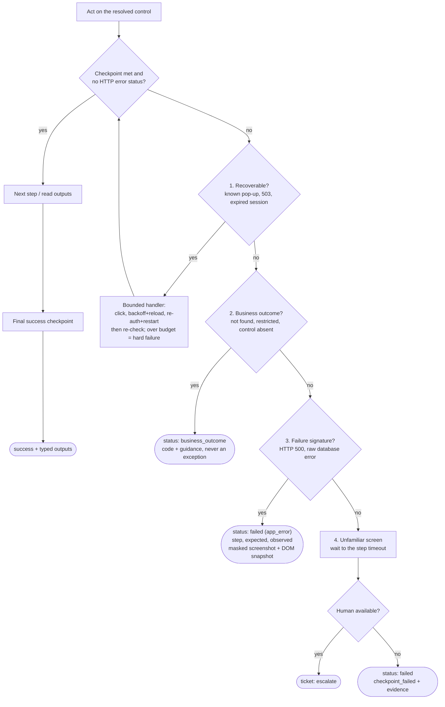
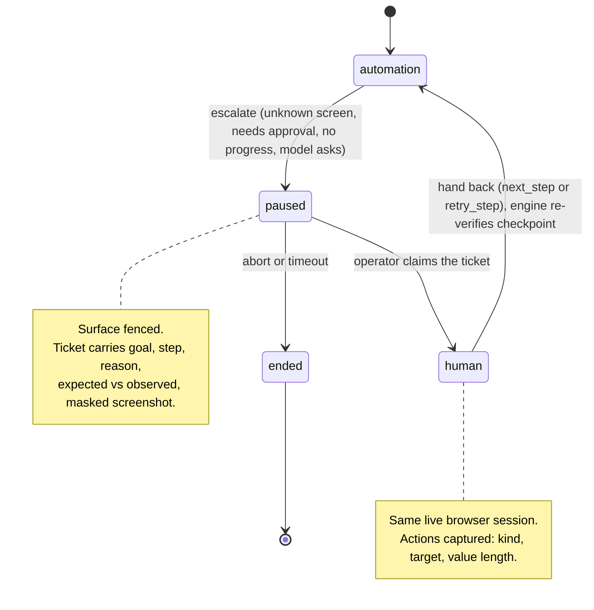
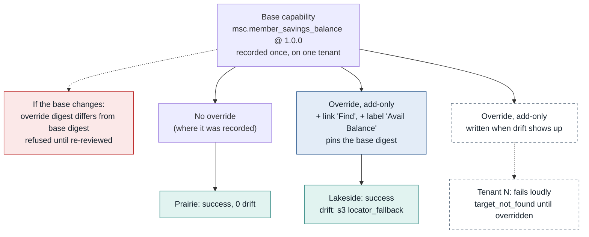

# Architecture

Five diagrams (GitHub renders the Mermaid below). Prose and trade-offs are in [`../REPORT.md`](../REPORT.md).
Dashed boxes are **designed, not built**.

## 1. Everything above the seam is surface-agnostic

Only a `Surface` knows how a control was found. The recorded flow says "click *this control*", never a selector or coordinate,
so a desktop or vision surface reuses the recorder, replay engine, policy, redaction and handoff unchanged.

## 2. The model is in the loop for one phase only

## 3. A missed checkpoint is classified, not guessed at

After each step the engine needs *checkpoint met* **and** *no frame reporting HTTP >= 400*. If not, it classifies the screen using
lists carried by the artifact, in this order (so a known interstitial is never mistaken for a failure).

## 4. Exactly one party drives the live session

The fence is enforced at the `Surface` (`perform()` / `goto()` raise `ControlViolation`), not by convention.
For approvals, `retry_step` means *approve and let automation perform it*.

## 5. One artifact, per-tenant overrides that can only add

Recorded on Prairie, the artifact fails on Lakeside with `target_not_found @ s3` (that bank labels the link **Find**). One fallback locator and one label
alias make it pass and the run reports `s3:locator_fallback`. An override cannot remove a locator, change an action or risk, or widen policy.
